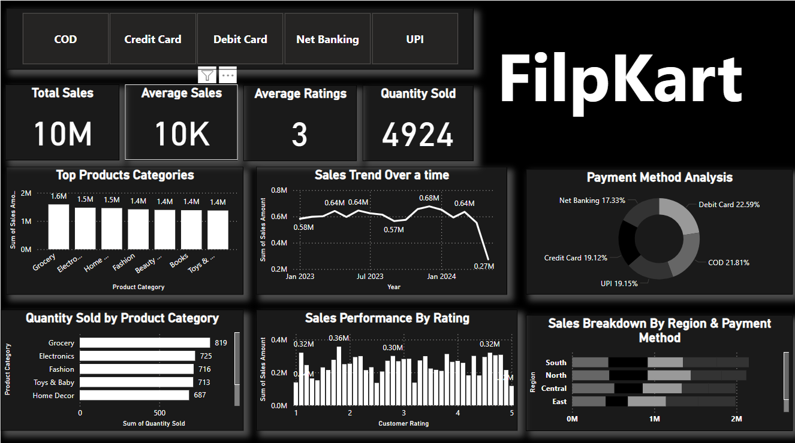

# Flipkart Sales Performance Analysis 📊

This project provides an in-depth analysis of Flipkart's sales data, focusing on user performance and region-wise (city) insights for the year 2023. The goal is to extract actionable insights on sales trends, customer behavior, and regional performance variations.

## 🔍 Project Overview

Using a dataset containing order details, product categories, customer ratings, payment methods, and regional sales, this analysis highlights:

- Total sales and orders by region
- Customer satisfaction trends (average ratings)
- Quantity sold and average sales per transaction
- Most effective discount strategies

## 📁 Data Description

The dataset includes the following columns:

- `Order ID`
- `Product Category`
- `Sales Amount`
- `Quantity Sold`
- `Order Date`
- `Region`
- `Customer Rating`
- `Payment Method`
- `Discount (%)`

## 📌 Key Insights

- South and North regions lead in total sales and quantity sold.
- Central region records the highest average sales per order.
- West region has the best customer ratings.
- Discounts do not always correlate with better customer ratings or higher quantity sold.

## 📊 Tools Used

- Python (Pandas, Matplotlib, Seaborn)
- Jupyter Notebook
- Excel for data source
- Power bi

## Dashboard Preview
- 
- 
 
